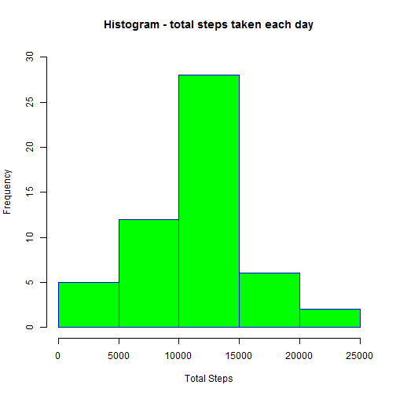

# Reproducible Research Week 1 Assignment
========================================================

## Assignment Details
The data is from a personal activity monitoring device. This device collects data at 5 minute intervals through out the day. The data consists of two months of data from an anonymous individual collected during the months of October and November, 2012 and include the number of steps taken in 5 minute intervals each day.

__Dataset__: https://d396qusza40orc.cloudfront.net/repdata%2Fdata%2Factivity.zip

The variables included in this dataset are:
* steps: Number of steps taking in a 5-minute interval (missing values are coded as NA)
* date: The date on which the measurement was taken in YYYY-MM-DD format
* interval: Identifier for the 5-minute interval in which measurement was taken
The dataset is stored in a comma-separated-value (CSV) file and there are a total of 17,568 observations in this dataset.

## Collecting the Activity Data for analysis
### Download the Souurce File
The source of the file is on the internet the file needs to be downloaded for use. The file will be downloaded in the current working directory. The code checks whether the Zip file exists, if not,then downloads the file. If the zip file exists and has not been unzippep, it will extract the csv file.


```r
zipFileURL<-"https://d396qusza40orc.cloudfront.net/repdata%2Fdata%2Factivity.zip"
zipFileName<-"repdata-data-activity.zip"
ActivityDataSource<- "activity.csv"
    
if (!file.exists(ActivityDataSource)){
    if(!file.exists(zipFileName)){
        download.file(zipFileURL, destfile=zipFileName, method="curl")
        unzip(zipFileName, exdir=".")
    }else {
        unzip(zipFileName, exdir=".")
    }
}else {
    message("The Activity Data Source file already exists")
}
```

```
## The Activity Data Source file already exists
```

## Loading and preprocessing the data to remove NA values
Remove the NA values from dataset

```r
activities<-read.csv(ActivityDataSource)
na_count<- apply(activities, 2, function(x) sum(is.na(x)))
```
Total NA values in the data 2304


```r
cleanedUpData<-na.omit(activities)
na_count<- apply(cleanedUpData, 2, function(x) sum(is.na(x))) 
```
After removing the NA values re-checking the NA count in the data 0

## Data Analysis - with removed NA values

### Calculate the total number of steps taken per day


```r
TotalStepsTable<-aggregate(cleanedUpData$steps, list(as.Date(cleanedUpData$date)), FUN=sum)
TotalStepsTable[1:5,]
```

```
##      Group.1     x
## 1 2012-10-02   126
## 2 2012-10-03 11352
## 3 2012-10-04 12116
## 4 2012-10-05 13294
## 5 2012-10-06 15420
```

#### Histogram Plot

```r
hist(TotalStepsTable$x, 
     main="Histogram - total steps taken each day", 
     xlab="Total Steps",
     ylim=c(0,30),
     border="blue", 
     col="green")
```

 
#### Mean

```r
meanSteps<- mean(TotalStepsTable$x)
meanSteps
```

```
## [1] 10766.19
```
Mean of the total steps 1.0766189 &times; 10<sup>4</sup>

#### Median

```r
medianSteps<- median(TotalStepsTable$x)
medianSteps
```

```
## [1] 10765
```
Median of the total steps 10765

### Average daily activities

```r
library(ggplot2)
dailyAverage <- aggregate(list(steps=cleanedUpData$steps), list(interval=cleanedUpData$interval), FUN=mean)

ggplot(data=dailyAverage, aes(x=interval, y=steps)) + 
    geom_line() + 
    xlab("5-minute interval") +
    ylab("average number of steps taken")
```

 

```r
maxInterval <- dailyAverage[which.max(dailyAverage$steps),]
```
### The 5 minutes interval with maximum average steps
The 5 minutes interval that contains maximum average steps 835

## preprocessing the data to substitute NA values with calculated assumptions
Calculate the NA values (repeated from above)

```r
NA_Count <- apply(activities, 2, function(x) sum(is.na(x)))
NA_Count
```

```
##    steps     date interval 
##     2304        0        0
```
The total number of missing values 2304

#### Filling up the missing values - mean of the 5 minutes interval

```r
fill.value <- function(steps, interval) {
    filled <- NA
    if (!is.na(steps))
        filled <- c(steps)
    else
        filled <- (dailyAverage[dailyAverage$interval==interval, "steps"])
    filled
    return(filled)
}
filled.data <- activities
filled.data$steps <- mapply(fill.value, filled.data$steps, filled.data$interval)
```

check for missing values in the new data set

```r
NA_Count <- apply(filled.data, 2, function(x) sum(is.na(x)))
NA_Count
```

```
##    steps     date interval 
##        0        0        0
```

## Data Analysis - with filled in values for NA (missing values)

### Calculate the total number of steps taken per day


```r
Filled_TotalStepsTable<-aggregate(filled.data$steps, list(as.Date(filled.data$date)), FUN=sum)
Filled_TotalStepsTable[1:5,]
```

```
##      Group.1        x
## 1 2012-10-01 10766.19
## 2 2012-10-02   126.00
## 3 2012-10-03 11352.00
## 4 2012-10-04 12116.00
## 5 2012-10-05 13294.00
```

#### Histogram Plot

```r
hist(Filled_TotalStepsTable$x, 
     main="Histogram - total steps taken each day", 
     xlab="Total Steps",
     ylim=c(0,40),
     border="blue", 
     col="orange")
```

 
#### Mean of filled data

```r
filled_meanSteps<- mean(Filled_TotalStepsTable$x)
```
Mean of the total steps 1.0766189 &times; 10<sup>4</sup>

#### Median of filled data

```r
filled_medianSteps<- median(Filled_TotalStepsTable$x)
```
Median of the total steps 1.0766189 &times; 10<sup>4</sup>

#### Comapring the data with missing values and when they are replaced
Mean with missing values 1.0766189 &times; 10<sup>4</sup>; Mean with filled values 1.0766189 &times; 10<sup>4</sup>

Median with missing values 10765; Median with filled values 1.0766189 &times; 10<sup>4</sup>

* The overall mean of the total daily average hasnot changed. 
* The histogram before and after replacing the missing values is very similar;      however, there is a change in frequenchy for the mid-range.
* The median has increased slightly.

### Activity Pattern between weekdays and weekends

```r
weekDayOrEnd <- function(date) {
    day <- weekdays(date)
    if (day %in% c("Monday", "Tuesday", "Wednesday", "Thursday", "Friday"))
        return("weekday")
    else if (day %in% c("Saturday", "Sunday"))
        return("weekend")
    else
        stop("invalid date")
}
filled.data$date <- as.Date(filled.data$date)
filled.data$day <- sapply(filled.data$date, FUN=weekDayOrEnd)
filled.data[1:10,]
```

```
##        steps       date interval     day
## 1  1.7169811 2012-10-01        0 weekday
## 2  0.3396226 2012-10-01        5 weekday
## 3  0.1320755 2012-10-01       10 weekday
## 4  0.1509434 2012-10-01       15 weekday
## 5  0.0754717 2012-10-01       20 weekday
## 6  2.0943396 2012-10-01       25 weekday
## 7  0.5283019 2012-10-01       30 weekday
## 8  0.8679245 2012-10-01       35 weekday
## 9  0.0000000 2012-10-01       40 weekday
## 10 1.4716981 2012-10-01       45 weekday
```


```r
averageByDay <- aggregate(steps ~ interval + day, data=filled.data, mean)
ggplot(averageByDay, aes(interval, steps)) + geom_line() + facet_grid(. ~ day) +
    xlab("5-minutes interval") + ylab("Average Number of steps")
```

 
